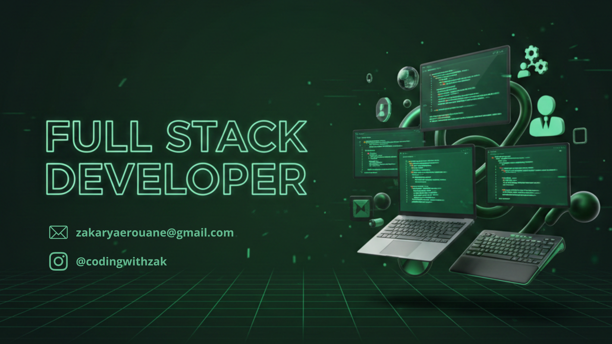

  
  
  <h1>🚀 Building Scalable Digital Experiences</h1>
  

    <b>Full Stack Web Developer | React & Laravel Specialist | Content Creator</b>
  

  

    
    
    
  

---

### 🧠 Profile Summary

I am **Zakaryae Rouane** (aka **Zakroun**), a results-driven Full Stack Developer passionate about bridging the gap between elegant design and robust backend architecture. With a strong foundation from **OFPPT** and hands-on experience in the Moroccan tech ecosystem, I specialize in building production-ready platforms that solve real-world problems.

* 🔭 **Currently:** Building AI-integrated web solutions and travel ecosystems.
* 🌱 **Learning:** Advanced Microservices architecture and Cloud Deployment.
* ✍️ **Community:** Sharing development tutorials to empower the next generation of Moroccan developers.
* 💬 **Ask me about:** React, Laravel, or how to build a scalable E-commerce MVP.

---

### 🛠️ Technical Arsenal

  

 

| Category | Tools & Technologies |
| :--- | :--- |
| **Frontend** | React.js, JavaScript (ES6+), Tailwind CSS, Bootstrap, HTML5/CSS3 |
| **Backend** | Laravel (PHP), Node.js, RESTful APIs |
| **Database** | MySQL, MongoDB |
| **DevOps/Tools** | Docker, Git/GitHub, Postman, Jira, VS Code |
| **Design/CMS** | Figma, Photoshop, WordPress |

---

### 🚀 Key Projects

* **DocsAura 🏥** – A comprehensive healthcare ecosystem connecting doctors and patients.
* **Unicomnova AI 🤖** – Advanced AI chatbot integration with deep analytics and admin oversight.
* **AFCON 2025 ⚽** – Real-time football platform featuring live scores and team statistics.
* **HomeNest 🏠** – A sleek real estate marketplace with integrated rental/selling workflows.
* **TripPlanner ✈️** – Personalized travel itinerary generator using modern web stacks.

---

### 💼 Professional Journey

#### 🔹 **OSI Software** | Full Stack Developer Intern (Rabat, 2025)
* Architected modular React + Laravel components for enterprise-level applications.
* Streamlined UI/UX workflows, improving user retention on core modules.

#### 🔹 **Yonetwork** | Full Stack Developer Intern (Meknès, 2025)
* Developed a **QR Code Attendance System** from scratch using React and Laravel.
* Managed RESTful API integrations and ensured data integrity for high-concurrency usage.

#### 🔹 **Medyouin** | AI & Web Developer Intern (Meknès, 2025)
* Integrated AI-driven chat functionalities into existing Laravel ecosystems.
* Optimized MySQL queries to enhance search performance within the platform.

---

### 📊 GitHub Activity

  
  

---

### 📬 Let's Collaborate

  
  
  

  <i>"Every line of code is a step closer to a vision."</i>

