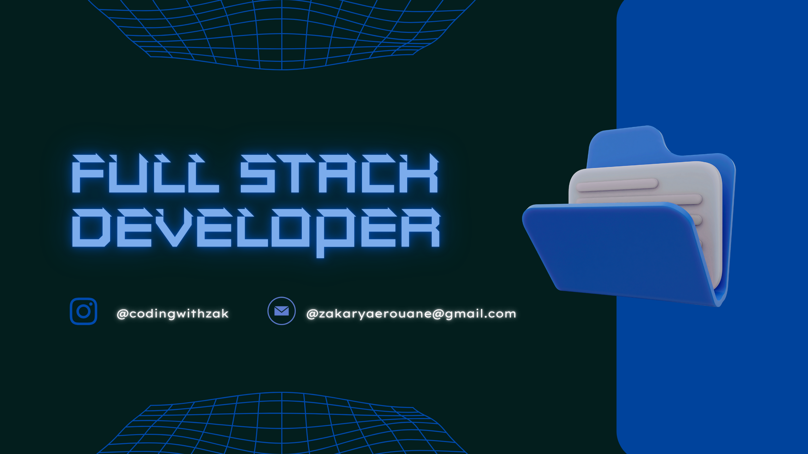

  

<h1 align="center">👋 Hey there, I'm Zakaryae Rouane!</h1>

###

  <b>Full Stack Web Developer | React & Laravel Enthusiast | Content Creator</b>

###

  

###

  
  
  

---

### 🧠 About Me

- 👋 Hi, I’m **@Zakroun**  
- 👀 I’m passionate about **web development**, **teaching**, and **creating engaging educational content**.  
- 🌱 I’m currently learning **advanced HTML techniques** and producing a **video series for beginners**.  
- 💼 I’m a **Full Stack Developer** trained at **OFPPT (2023–2025)**.  
- 💻 Experienced in building real projects like:
  - **DocSaura** → an online medical appointment management app.  
  - **ChatHub** → a simple, real-time messaging app with contact management.  
- 💞️ I love collaborating on **creative and educational web projects**.  
- ⚡ Fun fact: I’m growing my **Instagram community** by sharing web development tutorials!

---

### 📬 Connect With Me

  
  
  

---

### 🛠️ Technical Skills

#### 💻 Frontend
- HTML5, CSS3, JavaScript (ES6+)
- React.js, Tailwind CSS, Next.js, Storybook

#### ⚙️ Backend
- PHP (Laravel), Node.js, Django, RESTful APIs

#### 🧩 Database
- MySQL, MongoDB

#### ☁️ Tools & Platforms
- Git, GitHub, VSCode, Figma, Postman, AWS

#### 🎨 Others
- UI/UX basics, Photoshop, Responsive Design

---

### 🎓 Education & Certifications

- 🧾 **Technicien Spécialisé en Développement Web** (2023–2025)  
- 🎓 **Baccalauréat** – Lycée Lala Amina (2023)  
- 🐍 **Python Certificate** – 2024  
- 🧮 **SQL Certificate** – 2024  
- 💻 **Git & GitHub Certificate** – 2024  

---

### 💼 Experience

#### 🧩 Internship @ **Yonetwork** (Meknès, 2025)
- Built a **QR Code attendance tracking app** using **React + Laravel**  
- Integrated full stack features and **API RESTful connections**  
- Collaborated with a remote dev team using **Git & GitHub**

#### 💬 Internship @ **OSI Software** (Rabat, 2025)
- Developed **React + Laravel web modules**
- Worked in **team collaboration & version control**
- Enhanced UI/UX for real-world applications

---

### 🚀 Featured Projects

#### 🩺 DocSaura
- A web platform for **medical appointment management**  
- Includes registration, online scheduling, notifications & reminders  
- Stack: **React, Laravel, MySQL**

#### 💬 ChatHub
- Real-time **messaging app** with contact management  
- Stack: **HTML, CSS, JS, PHP, MySQL**

---

### 🌍 Languages

- 🇫🇷 French   
- 🇬🇧 English   
- 🇲🇦 Arabic   

---

### 📈 GitHub Analytics

  

---

### 🏆 Achievements

  

---

### 💬 Personal Quote

> "Code. Create. Inspire.  
> Every line you write is a step closer to your vision."

---

<!---
Zakroun/Zakroun is a ✨ special ✨ repository because its `README.md` (this file) appears on your GitHub profile.
You can click the Preview link to take a look at your changes.
--->
